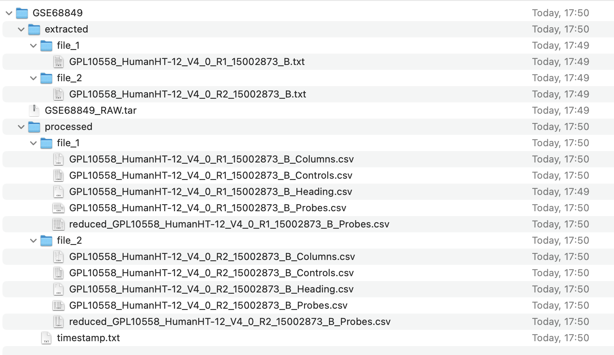

#### Luigi:

===== Luigi Execution Summary =====

Scheduled 4 tasks of which:
* 4 ran successfully:
    - 1 DownloadDataset(dataset_name=GSE68849)
    - 1 ExtractTarFile(dataset_name=GSE68849)
    - 1 Pipeline(dataset_name=GSE68849)
    - 1 ProcessFiles(dataset_name=GSE68849)

This progress looks :) because there were no failed tasks or missing dependencies

===== Luigi Execution Summary =====

#### Data

